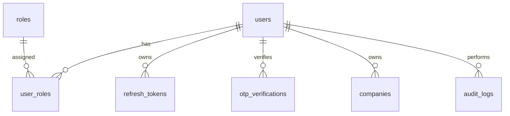
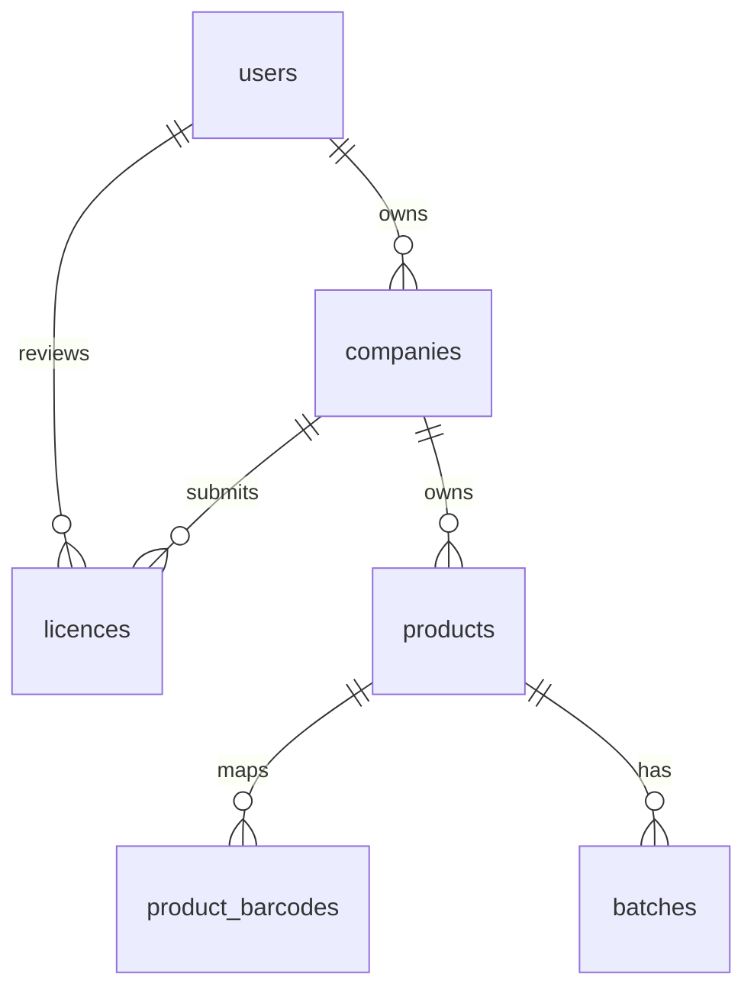
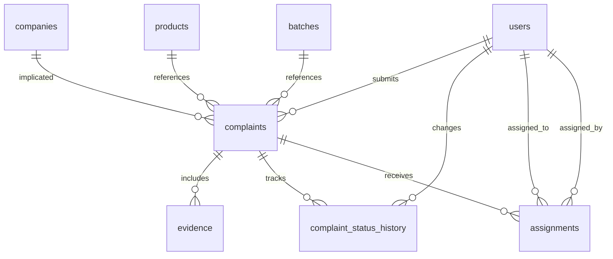
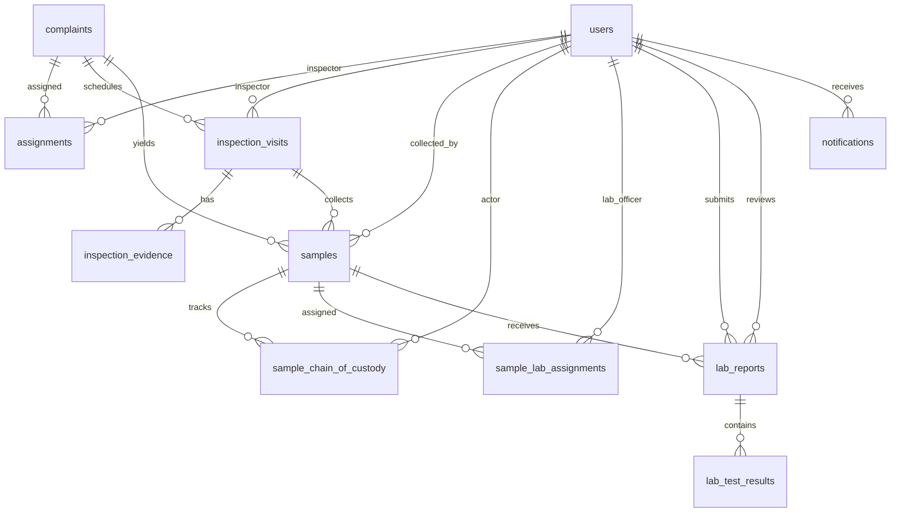
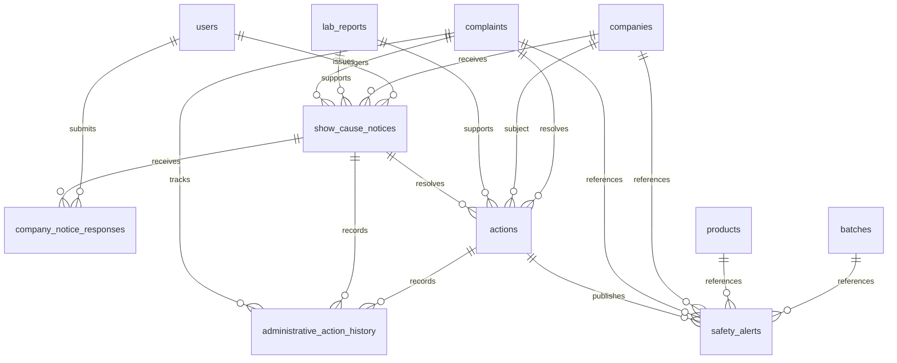
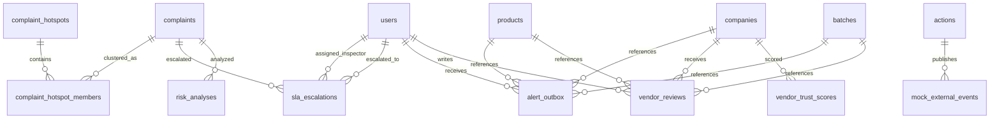

# AaharRakshak MySQL Schema

The authoritative database schema lives in Flyway migrations:

- `backend-spring/src/main/resources/db/migration/V1__initial_schema.sql`
- `backend-spring/src/main/resources/db/migration/V2__authentication_and_security.sql`
- `backend-spring/src/main/resources/db/migration/V3__company_licence_product_batch_management.sql`
- `backend-spring/src/main/resources/db/migration/V4__citizen_complaint_scanning_system.sql`
- `backend-spring/src/main/resources/db/migration/V5__official_investigation_sample_lab_reporting.sql`
- `backend-spring/src/main/resources/db/migration/V6__transparency_administrative_action_web_portals.sql`
- `backend-spring/src/main/resources/db/migration/V7__advanced_intelligence_hotspots_alerts_sla_trust.sql`

Design principles:

- Use surrogate `BIGINT` primary keys for internal references.
- Keep licence, product, batch and complaint information normalized.
- Store media/report binaries outside MySQL and keep only metadata and object keys.
- Keep complainant private data on `users`; never expose it through public report projections.
- Store mock Aadhaar verification status/token only. Never store full Aadhaar numbers, images or biometric data.
- Track official and system actions in `audit_logs`.
- Model workflow status using constrained enums in application code and string columns in the database for portability.

## Phase 2 Auth Relationships

Phase 2 adds BCrypt password hashes, login attempt counters, lock timestamps, email/mobile verification flags, hashed refresh tokens and mock OTP rows. Company self-registration creates an account with the `COMPANY` role and a linked `companies` row with `PENDING_VERIFICATION` status.

## Phase 3 Company And Catalogue Relationships

Phase 3 adds company profile fields, 14-digit FSSAI licence submissions, deterministic mock licence-registry review fields, product brand/category/manufacturer details, product and licence-label image metadata, normalized barcode/GTIN mappings and batch statuses: `ACTIVE`, `UNDER_INVESTIGATION`, `RECALLED`, `BLOCKED`.

The mock registry adapter does not scrape or call government systems. Product and licence images are represented by object metadata only; binaries stay outside MySQL.

## Phase 4 Complaint Scanning And Evidence Relationships

Phase 4 extends `complaints` with:

- `complaint_type`: `PACKAGED_FOOD` or `PREPARED_DISH`.
- Barcode and OCR fields for detected product/company/FSSAI/batch/expiry values.
- Corrected fields for citizen-confirmed product/company/FSSAI/batch/expiry values.
- Vendor name/address for unknown product or prepared-dish complaints.
- GPS consent, latitude, longitude, address and submitted timestamp fields.

Phase 4 extends `evidence` with original file name, size, checksum, captured timestamp and mock object-storage URI fields. Binaries remain outside MySQL. `complaint_status_history` stores the complaint timeline separately from the latest status on `complaints`, preserving normalized workflow history for drafts, submissions and later official transitions.

The V4 seed data adds one packaged-food complaint (`ARK-SEED-0001`), evidence metadata, status history and an assignment to the demo food inspector for authorization tests.

## Phase 5 Official Investigation Relationships

Phase 5 adds:

- `complaints.district` and `complaints.sla_due_at` for district routing and investigation SLA tracking.
- `inspection_visits` for scheduling, geotagged check-in and visit notes.
- `inspection_evidence` for inspection image/video metadata with checksums and mock object-storage URIs.
- Additional `samples` columns for sample number, seal number, quantity, collection coordinates and storage details.
- `sample_chain_of_custody` for collection, transfer, lab receipt and report-state events.
- `sample_lab_assignments` for assigning samples to lab officers and confirming receipt.
- `lab_reports.status`, PDF metadata, checksum, submit/review/publish timestamps and reviewer links.
- `lab_test_results` for individual testing parameters, methods, limits, values and compliance flags.

The V5 seed data adds `ARK-SEED-0005`, a mock inspected complaint with a completed visit, inspection image metadata, sealed sample `SMP-SEED-0005` / `SEAL-SEED-0005`, custody entries and an assignment to `lab@aaharrakshak.dev`.

## Phase 6 Transparency And Administrative Action Relationships

Phase 6 adds:

- `lab_reports.outcome`: `SAFE`, `SUSPICIOUS`, `ADULTERATED` or `INCONCLUSIVE`.
- `show_cause_notices`: company notices linked to complaint, published lab report, company and issuing official.
- `company_notice_responses`: response text and document metadata/checksum for company submissions.
- Additional `actions` fields for report/company/notice links, simulated action number, reason, evidence, effective date and public summary.
- `administrative_action_history`: append-oriented workflow history for notice issuance, company response, review and decision.
- `safety_alerts`: public recall/safety alert records derived from simulated administrative decisions.

The V6 seed data adds `ARK-SEED-0006` with published report `LAB-SEED-0006` and `ADULTERATED` mock outcome for transparency and due-process workflow tests. This seed is separate from `ARK-SEED-0005` so Phase 5 sample/lab tests remain stable.

## Phase 7 Intelligence, Alerts, SLA And Trust Relationships

Phase 7 adds:

- `complaint_hotspots`: district-level aggregate clusters with related product/vendor key, risk level, complaint count, affected radius and center coordinates.
- `complaint_hotspot_members`: join table between hotspots and complaints.
- `alert_outbox`: durable retryable notification records for in-app, email, push and SMS mock channels.
- `sla_escalations`: high-risk overdue investigation escalation records with previous status, assigned inspector and senior official.
- `vendor_reviews`: receipt-backed reviews with receipt metadata/checksum and mock OCR verification token.
- `vendor_trust_scores`: calculated score components for inspections, lab outcomes, recalls and verified reviews.
- `risk_analyses`: explainable rule-based risk score snapshots and camera/OCR safety note.
- `mock_external_events`: simulated storefront, delivery and payment events for recalled/suspended batches or licences.

The V7 seed data adds `ARK-HOT-0001` through `ARK-HOT-0010` for hotspot detection and `ARK-SLA-0007` for overdue SLA escalation. V7 also moves the historical Phase 5 seed complaint SLA due date forward so the Phase 7 overdue demo does not mutate the Phase 5 lab-report workflow fixture.
