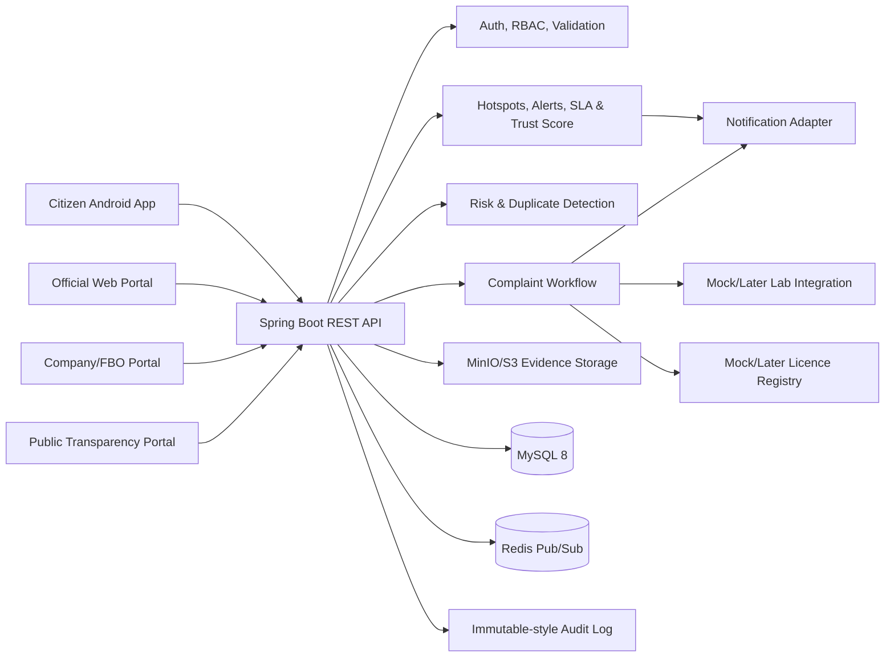
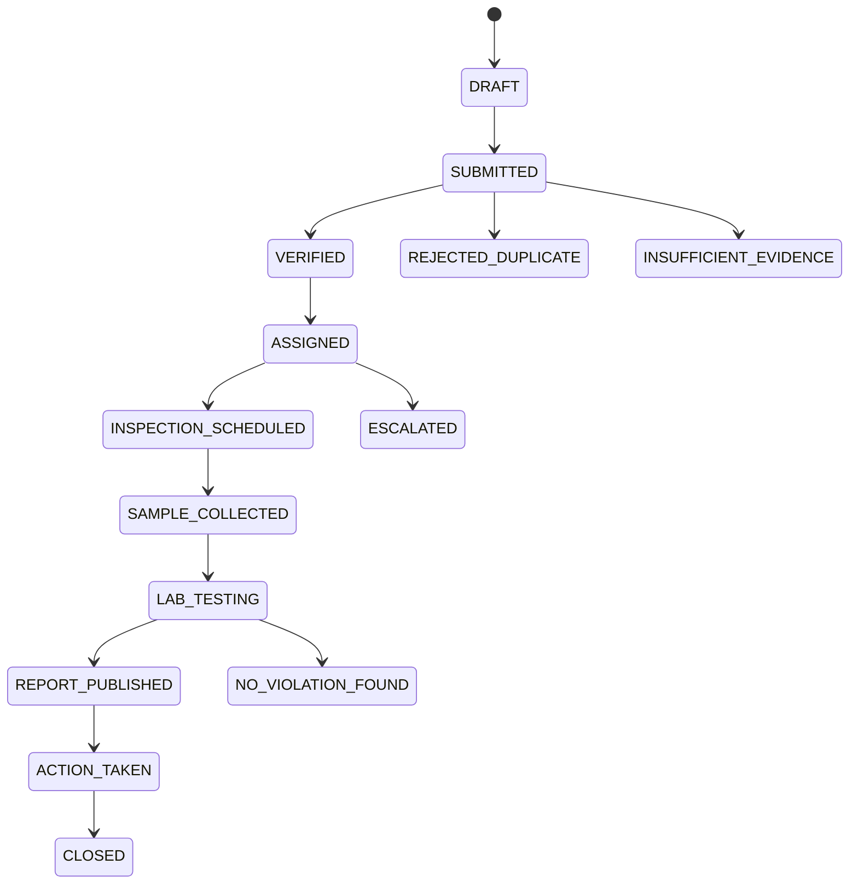
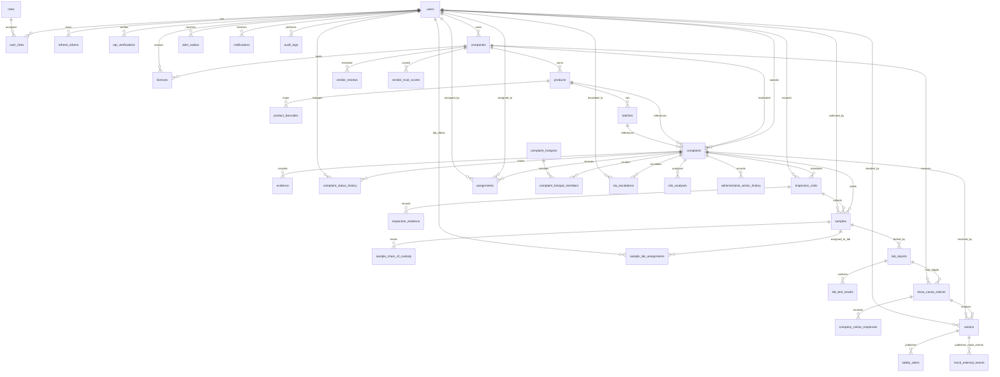
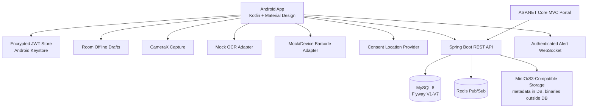
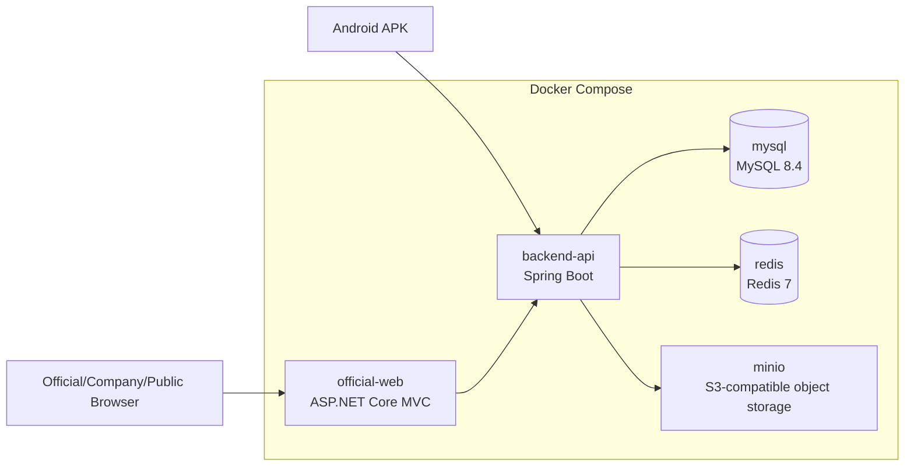

# AaharRakshak Architecture

## Goals

AaharRakshak uses a modular monolith first. The Spring Boot API owns business rules, workflow transitions, persistence, validation, security and audit logging. Web and Android clients consume the API and do not duplicate official workflow logic.

## Current Phase Assumptions

- Additional catalogue and workflow demo data can be seeded later for products, licences, batches and lab reports.
- Phase 2 seeds development users for every role.
- Phase 3 seeds mock company, licence, product, barcode and batch records for testing.
- Phase 4 seeds a mock packaged-food complaint assigned to a food inspector.
- Phase 5 seeds a mock inspected complaint with a sealed sample assigned to a lab officer.
- Phase 6 seeds a separate published mock lab report for due-process and transparency workflow testing.
- Phase 7 seeds clustered complaints for hotspot detection and a separate overdue high-risk complaint for SLA escalation testing.
- Citizen identity verification is represented as status/token fields only.
- Full Aadhaar numbers, Aadhaar documents and biometrics are outside scope and must not be stored.
- Licence suspension is modelled as an administrative action record only for the academic demo.
- Barcode, OCR, SMS, government registries, file storage and AI checks use mock/adapter boundaries until authorized integrations exist.

## Logical Blocks

## Complaint Flow

## Database ER Diagram

## Normalized Schema Design

The relational model separates identity, RBAC, company catalogue data, complaint evidence, official assignments, laboratory work, notifications and audit logs.

Core tables:

- `users`: citizen, company and official accounts with masked identity verification fields.
- `roles`, `user_roles`: role-based access control.
- `refresh_tokens`: hashed refresh token records rotated on use.
- `otp_verifications`: mock email/mobile OTP records for development verification.
- `companies`: FBO/company registration, contact/profile details and verification status, optionally owned by a company user.
- `licences`: 14-digit FSSAI licence submissions, review outcome, mock registry token/status and licence-label image metadata.
- `products`: product, brand, category, manufacturer and product-label metadata linked to companies.
- `product_barcodes`: normalized barcode/GTIN mappings linked to products.
- `batches`: batch/lot data and status linked to products.
- `complaints`: workflow state, packaged-food/prepared-dish type, category, GPS consent/location, vendor text, risk score, catalogue links and detected/corrected scan fields.
- `evidence`: metadata, checksums and timestamps for photos, videos, receipts and lab-related files stored outside the database.
- `complaint_status_history`: append-style complaint status timeline linked to the complaint and optional user who changed it.
- `inspection_visits`: scheduled visit, geotagged check-in, notes and completion metadata.
- `inspection_evidence`: inspection image/video metadata, object keys and checksums.
- `assignments`: official assignment history.
- `samples`: sample/seal numbers, quantity, collection coordinates, storage details and collection metadata.
- `sample_chain_of_custody`: append-style custody events from collection through report publication.
- `sample_lab_assignments`: laboratory officer assignment and sample-received confirmation.
- `lab_reports`: secure PDF report metadata, checksum and report workflow status.
- `lab_test_results`: individual laboratory testing parameters and outcomes.
- `show_cause_notices`: due-process notices issued to companies after published non-safe lab outcomes.
- `company_notice_responses`: company response text and document metadata/checksum.
- `actions`: simulated legal/administrative decisions recorded by authorized officials.
- `administrative_action_history`: append-oriented notice, response, review and decision history.
- `safety_alerts`: public safety/recall alert records derived from simulated actions.
- `notifications`: citizen/company/official message delivery records.
- `complaint_hotspots`, `complaint_hotspot_members`: district-level complaint clusters using configurable radius/time windows.
- `alert_outbox`: durable in-app/email/push/SMS alert delivery attempts with retry state.
- `sla_escalations`: high-risk overdue investigation escalations and administrative-lapse records.
- `vendor_reviews`, `vendor_trust_scores`: receipt-backed reviews and calculated company/vendor Trust Score.
- `risk_analyses`: rule-based explainable risk score snapshots.
- `mock_external_events`: simulated storefront, delivery and payment integration events after recalls/suspensions.
- `audit_logs`: append-oriented official and system activity records.

## Backend Modules

- `user`: users, roles and RBAC mappings.
- `auth`: registration, login, refresh tokens, OTP and mock Aadhaar verification.
- `security`: JWT parsing, Spring Security configuration and role-protected API gates.
- `admin`: central administrator actions.
- `company`: companies and licences.
- `catalog`: products, barcode lookup and batches.
- `storage`: MinIO-compatible metadata interface with a local/mock implementation.
- `complaint`: barcode-first scanning, OCR adapter boundary, complaint drafts/submission, evidence validation, citizen views and assigned-official views.
- `investigation`: official dashboards, inspector assignments, visits, samples, custody, laboratory assignments, lab results and report publication.
- `action`: show-cause notices, company responses, senior-official review, simulated administrative decisions and action history.
- `transparency`: anonymized public complaint tracking, public lab reports, recall notices, alerts and licence/batch status.
- `intelligence`: hotspot detection, Redis/WebSocket alerts, SLA escalation, Trust Score, verified reviews, mock risk analysis and mock external events.
- `notification`: notification records.
- `audit`: audit log records.
- `health`: API health endpoint.

## External Integration Boundaries

The codebase keeps external dependencies behind adapter boundaries:

- Identity verification: mock OTP/token service.
- Barcode/OCR: barcode lookup uses local catalogue data; OCR uses confidence-scored mock extraction for development.
- SMS/email/push: mock provider in demo.
- Redis/WebSocket alerts: authenticated WebSocket and Redis Pub/Sub are used for demo alert fan-out; the database outbox remains the durable source.
- Licence registry: deterministic mock adapter only; no scraping or unauthorized government data.
- Lab systems: uploaded report metadata until traceable integration.
- Object storage: mock MinIO-compatible metadata service locally, S3/MinIO-compatible binary storage later.
- External storefront, delivery and payment systems: interfaces publish mock events only and never disable a real account or service.

## Phase 4 Citizen Complaint Flow

Packaged-food complaints begin with `POST /api/v1/citizen/scans/packaged-food`. The service checks the local barcode/GTIN catalogue first and then adds mock OCR hints for product name, company, FSSAI licence, batch and expiry. The response carries a safety note because image and OCR output are only triage aids and must never be presented as proof of adulteration.

Citizens create `DRAFT` complaints, correct uncertain scan details, attach validated evidence metadata and submit the draft to receive a unique `ARK-yyyyMMdd-######` tracking number. Prepared-dish complaints do not require a company record; they capture vendor name/address, dish image, vendor image and GPS coordinates only after explicit user consent.

Citizen endpoints return only the authenticated citizen's complaints. Official complaint endpoints require an official role and then enforce assignment, except district officers and central administrators who may view by oversight role. Complaint responses intentionally omit citizen email, mobile number and personal identity fields.

## Phase 5 Investigation Flow

District officers and central administrators use the priority dashboard to view active complaints with risk score, SLA due date and map-ready complaint/vendor coordinates. They assign verified or submitted complaints to food inspectors by district/location. Food inspectors can view and act only on complaints assigned to them.

Inspectors schedule visits, perform geotagged check-ins, record notes plus image/video metadata, and collect sealed samples. Every sample receives a generated sample number, caller-provided seal number, quantity, collection time, GPS/location text and storage details. Chain-of-custody events are stored separately so transfer and receipt history remains append-oriented.

Senior officials assign samples to lab officers. Only the assigned lab officer can confirm receipt, create PDF report drafts with checksums and testing parameters, and submit reports. Only district officers or central administrators can review and publish reports. Publishing a report moves the complaint to `REPORT_PUBLISHED`, records audit/custody history and sends a citizen-safe status notification. The platform does not automatically impose real licence bans.

## Phase 6 Transparency And Administrative Action Flow

Published lab reports carry one of four outcomes: `SAFE`, `SUSPICIOUS`, `ADULTERATED` or `INCONCLUSIVE`. Senior officials may issue a show-cause notice for non-safe outcomes. Companies view only their own notices and submit response text plus document metadata; binaries still live outside MySQL.

After review, only district officers or central administrators can record a final simulated decision: `WARNING`, `BATCH_RECALL`, `TEMPORARY_SUSPENSION` or `CANCELLATION`. The service prevents a report-submitting lab officer or assigned inspector from approving their own case. Licence suspension/cancellation is never sent to a real registry; it is represented as a simulated platform action and audit record. Batch recall updates the platform batch status to `RECALLED` for public safety signalling.

The public transparency module exposes anonymized complaint status, published lab report summaries, public search, public licence/batch status, recalls and safety alerts. It does not expose citizen names, phone numbers, email addresses, exact private contact details, chain-of-custody internals, inspector/lab officer strategy or sensitive official notes.

The ASP.NET Core MVC portal in `official-web-dotnet/` consumes Spring Boot REST APIs with `HttpClient`, cookie-based server-side authentication and role-based navigation. It contains separate Official, Company and Public Areas and does not duplicate backend business rules.

## Phase 7 Intelligence, Alerts And SLA Flow

The intelligence module clusters complaints by related product/vendor, district, configurable radius and configurable time window. The default critical hotspot rule is 10 related complaints within 24 hours in one area. Hotspot APIs return only aggregate district-level center coordinates, complaint counts, product/vendor labels, risk level and affected radius. Public APIs do not expose individual citizen coordinates.

Recall and safety alerts use an `alert_outbox` table before dispatch so delivery can be retried. The demo includes mock in-app, email, push and SMS adapters, Redis Pub/Sub publication and an authenticated `/ws/alerts` WebSocket endpoint. Batch-recall decisions notify affected users by matching the contaminated batch and region, while public recall pages remain anonymized.

SLA escalation checks high-risk complaints using configurable SLA thresholds; the default high-risk SLA is 48 hours. Overdue cases are escalated to a district officer, audit logs record both escalation and administrative lapse, and assigned inspectors are blocked from silently closing verified high-risk cases.

Trust Score is calculated from verified inspections, published lab outcomes, simulated recalls and receipt-backed reviews. Raw complaints alone do not prove guilt and are not used alone to reduce the score. Receipt OCR and AI risk analysis use rule-based mock adapters for the academic demo, and camera/OCR evidence remains only a triage aid until laboratory confirmation.

The ASP.NET portal adds official hotspot, escalation and alert operations dashboards plus a public Trust Score page. The portal renders Leaflet/OpenStreetMap hotspot maps from backend aggregate data and continues to rely on Spring Boot for authorization and workflow rules.

## Phase 8 Android, Deployment And Delivery Flow

The Android app in `android-app/` is a native Kotlin client. It keeps the backend as the source of truth for workflow, authorization, privacy redaction and official decisions. The app handles citizen-facing capture and confirmation only:

- Registration, mock OTP verification and login through `/api/v1/auth/**`.
- JWT access/refresh tokens stored in Android Keystore-backed encrypted storage.
- Barcode-first packaged-food lookup, CameraX-ready package image capture and mock OCR extraction.
- Citizen correction of product, company, FSSAI licence, batch and expiry details before submission.
- Prepared-dish/street-food complaint flow with vendor text, images and consented location.
- Evidence metadata with checksum/timestamp; binaries are represented as object-storage keys.
- Room database for offline complaint drafts.
- Public product, licence, batch, report, alert, hotspot and Trust Score screens.
- WebSocket alert client with a mock notification fallback.
- English and Hindi string resources.

## Deployment Container View

## Phase 8 Security And Privacy Additions

- CORS origins are configured through `CORS_ALLOWED_ORIGINS` for Android emulator, portal and hosted subdomains.
- The Spring API emits secure headers, uses stateless JWT security and includes a simple configurable rate-limit filter for demo abuse protection.
- Upload limits are environment-configured with `MAX_FILE_SIZE` and `MAX_REQUEST_SIZE`; file validators continue to enforce type, size, checksum and object-key rules.
- The portal globally validates anti-forgery tokens on unsafe HTTP methods and sets browser security headers.
- Production secrets are represented only as environment variables and `.env.example` placeholders.
- Android never asks for full Aadhaar data and repeats the lab-confirmation warning in the complaint flow.
